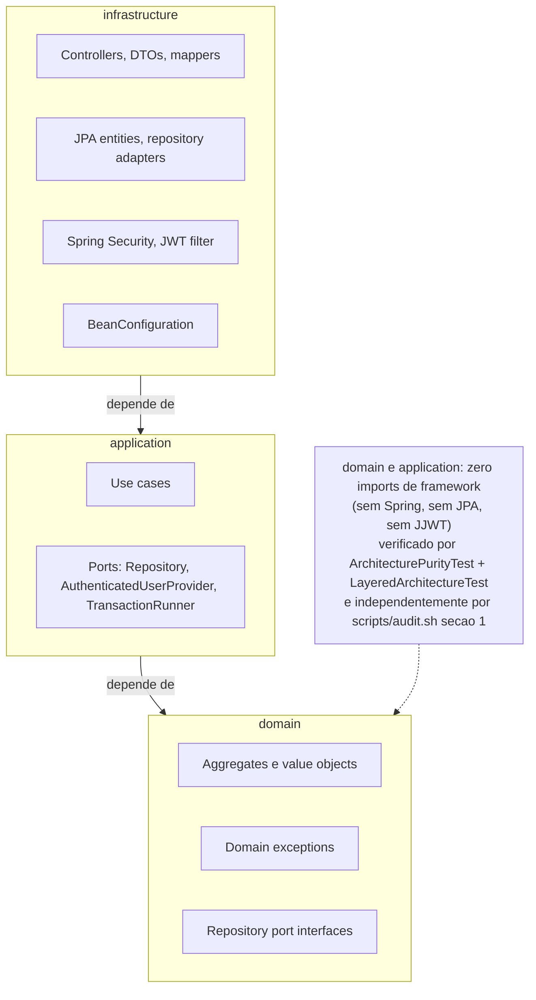
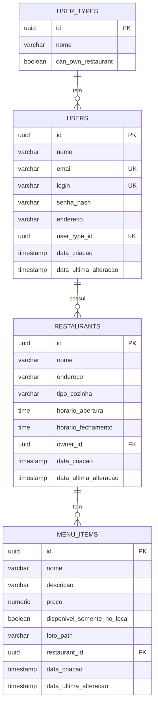
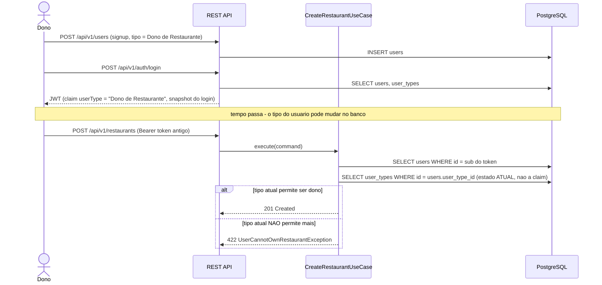

# Restaurant Management System — Fase 2

Backend compartilhado para gestão de restaurantes, desenvolvido como Fase 2
do Tech Challenge de "Arquitetura e Desenvolvimento Java" da FIAP Pós Tech.

## O problema

Um dono de restaurante precisa cadastrar seu estabelecimento e seu cardápio
e gerenciá-los ao longo do tempo; um cliente precisa navegar por
restaurantes e cardápios sem poder alterá-los. O sistema modela os dois
papéis como o mesmo agregado `User`, diferenciados por `UserType`
("Dono de Restaurante" | "Cliente"), e expõe uma API REST com autenticação
JWT para as quatro entidades do domínio: **User**, **UserType**,
**Restaurant** e **MenuItem** — CRUD completo em cada uma, com as regras de
autorização (quem pode criar/editar/apagar o quê) vivendo como código de
use case, nunca como anotação de framework.

## Stack e requisitos

- Java 21, Spring Boot 3.3.5, Maven (módulo único)
- PostgreSQL + Flyway (6 migrations, `V1`–`V6`)
- Spring Data JPA (só na camada de infraestrutura)
- Spring Security 6 + JWT (JJWT)
- springdoc-openapi (Swagger UI)
- JUnit 5, Mockito, AssertJ, Testcontainers, ArchUnit
- JaCoCo (gate de 80% de cobertura de linha)
- Docker + Docker Compose

Para rodar via Docker: só Docker Desktop (ou Engine + Compose v2). Para
rodar localmente sem container da aplicação: JDK 21 + Maven (o `mvnw`
incluso resolve a versão do Maven sozinho) + Docker só para o Postgres.

## Como executar

### Com Docker Compose (um comando)

```bash
docker compose up --build
```

Sobe com valores padrão de desenvolvimento definidos no próprio
`docker-compose.yml` — **nenhum `.env` é necessário**. Para usar um
segredo JWT ou credenciais de banco próprios, `cp .env.example .env` e
edite antes de subir (o Compose carrega `.env` automaticamente se ele
existir).

A aplicação sobe em `http://localhost:8080`, com Swagger UI em
`http://localhost:8080/swagger-ui.html`.

### Localmente

```bash
# suba apenas o Postgres
docker compose up postgres -d

# rode a aplicação
./mvnw spring-boot:run
```

## Como testar

```bash
./mvnw verify
```

Roda, nesta ordem: testes unitários (JUnit 5/Mockito/AssertJ) → testes de
integração com Postgres real via Testcontainers → regras de arquitetura
(ArchUnit) → gate de cobertura JaCoCo (mínimo 80% de linha, `BUNDLE`/
`LINE`/`COVEREDRATIO`, falha o build se não atingir). Requer Docker em
execução.

Depois de rodar, o relatório de cobertura fica em
`target/site/jacoco/index.html`. Uma execução desta sessão (reprodutível
com o comando acima) mediu **222 testes, 0 falhas, 96% de cobertura de
linha (1019/1056 linhas)** — um retrato do momento em que este README foi
escrito, não uma promessa permanente; rode você mesmo para conferir o
número atual.

Auditoria estrutural complementar (regras que um build verde não pega
sozinho — ver seção de Arquitetura abaixo):

```bash
bash scripts/audit.sh
```

### Coleção Postman

Em [`postman/`](postman/): `RestaurantManagement.postman_collection.json` +
`RestaurantManagement.postman_environment.json`.

1. Suba a aplicação (Docker Compose ou localmente).
2. No Postman: **Import** os dois arquivos.
3. Selecione o environment "Restaurant Management - Fase 2" (canto superior
   direito).
4. Abra a coleção → **Run** (Collection Runner) → Run Restaurant Management.

Roda do início ao fim sem nenhum passo manual, contra um banco vazio: cada
pasta encadeia o estado da anterior via variáveis de ambiente (`userId`,
`token`, `restaurantId`, `menuItemId`, ...) capturadas nos scripts de teste
de cada requisição. As únicas duas UUIDs fixas na coleção são os tipos de
usuário semeados (`donoTypeId`/`clienteTypeId`, documentados no próprio
arquivo de environment). Pode ser executada mais de uma vez contra o mesmo
banco sem falhar — um script de pré-requisição no nível da coleção gera um
sufixo único por execução, usado em todo e-mail/login que precisa ser
único.

Estrutura: uma pasta por agregado (`Auth`, `Users`, `UserTypes`,
`Restaurants`, `MenuItems`) demonstrando CRUD completo, mais uma pasta final
`Regras de negocio e erros` cobrindo os casos que diferenciam este projeto
(401/403/404/409/422/400 — incluindo a armadilha de rota aninhada do
`MenuItem`, que deve devolver 404 e nunca 403). `bash scripts/audit.sh`
(seção 10) falha o build se um endpoint mudar de rota e a coleção não for
atualizada junto.

## Arquitetura

Clean Architecture em três camadas, com a regra de dependência sempre na
mesma direção:

```
infrastructure → application → domain
```

`domain` e `application` têm **zero dependências de framework** (nada de
Spring, JPA ou JJWT) — não por convenção informal, mas verificado por
**dois mecanismos independentes**: o teste ArchUnit
(`ArchitecturePurityTest` + `LayeredArchitectureTest`) e, separadamente,
`scripts/audit.sh` (seção 1), que refaz a mesma checagem sem depender do
ArchUnit — se uma regra do ArchUnit for mal escopada e passar vazia (já
aconteceu neste projeto), o `audit.sh` ainda pega.



### Modelo de dados

Gerado a partir das migrations reais (`V1`–`V6`), não de memória:



### A decisão mais importante deste projeto, em um diagrama

A claim `userType` dentro do JWT é um retrato do momento do login — nunca é
revalidada a cada requisição. Qualquer decisão de autorização tem que reler
o estado atual do banco, nunca confiar na claim:



Provado, não só desenhado: `RestaurantIntegrationTest.staleTokenClaimDoesNotGrantOwnership`
demote um usuário logado via `PUT /api/v1/users/{id}` e reusa o token
*antigo* — o resultado é 422, não 201.

## Catálogo de endpoints

Autenticação: `Bearer <token>` obtido em `POST /api/v1/auth/login`. Rotas
marcadas "Não" são públicas.

| Método | Rota | Autenticação | Status possíveis |
|---|---|---|---|
| POST | /api/v1/auth/login | Não | 200, 400, 401 |
| POST | /api/v1/users | Não | 201, 400, 409, 422 |
| GET | /api/v1/users/{id} | Sim | 200, 401, 404 |
| GET | /api/v1/users | Sim | 200, 401 |
| PUT | /api/v1/users/{id} | Sim | 200, 400, 401, 404, 409, 422 |
| DELETE | /api/v1/users/{id} | Sim | 204, 401, 404, 409 |
| POST | /api/v1/user-types | Sim | 201, 400, 401, 409 |
| GET | /api/v1/user-types/{id} | Não | 200, 404 |
| GET | /api/v1/user-types | Não | 200 |
| PUT | /api/v1/user-types/{id} | Sim | 200, 400, 401, 404, 409 |
| DELETE | /api/v1/user-types/{id} | Sim | 204, 401, 404, 409 |
| POST | /api/v1/restaurants | Sim | 201, 400, 401, 403, 422 |
| GET | /api/v1/restaurants/{id} | Sim | 200, 401, 404 |
| GET | /api/v1/restaurants | Sim | 200, 401 |
| PUT | /api/v1/restaurants/{id} | Sim | 200, 400, 401, 403, 404 |
| DELETE | /api/v1/restaurants/{id} | Sim | 204, 401, 403, 404 |
| POST | /api/v1/restaurants/{restaurantId}/menu-items | Sim | 201, 400, 401, 403, 404 |
| GET | /api/v1/restaurants/{restaurantId}/menu-items/{id} | Sim | 200, 401, 404 |
| GET | /api/v1/restaurants/{restaurantId}/menu-items | Sim | 200, 401, 404 |
| PUT | /api/v1/restaurants/{restaurantId}/menu-items/{id} | Sim | 200, 400, 401, 403, 404 |
| DELETE | /api/v1/restaurants/{restaurantId}/menu-items/{id} | Sim | 204, 401, 403, 404 |

Notas sobre a coluna de status, derivadas diretamente de
`GlobalExceptionHandler` e do que cada use case realmente lança (não de
memória): **404 só aparece em rotas cujo próprio path carrega um id de
recurso** — por isso `POST /api/v1/users` e `POST /api/v1/restaurants`
(sem id no path; uma referência ruim no corpo é 422, não 404) nunca listam
404, enquanto `POST /restaurants/{restaurantId}/menu-items` lista 404
legitimamente, porque `restaurantId` é, ele mesmo, um alvo de URL. Esta
tabela é verificada contra os controllers de verdade por
`scripts/audit.sh` (seção 12) — um endpoint que mudar de rota sem
atualizar esta tabela quebra o build.

## Decisões de Arquitetura

Cada decisão abaixo é código, não intenção — o link aponta para o teste
que efetivamente a prova.

1. **Clean Architecture com `domain` e `application` livres de
   framework**, use cases conectados como `@Bean` em `BeanConfiguration`
   (nunca `@Service`/`@Component`). *Por quê*: a regra de autorização é
   lógica de negócio, não deveria depender de o time trocar de framework
   web ou ORM. *Trade-off*: mais boilerplate de wiring manual do que
   `@ComponentScan` daria de graça.
   → `ArchitecturePurityTest` + `scripts/audit.sh` seção 1 (dois
   mecanismos independentes) · [`specs/technical/architecture.md`](specs/technical/architecture.md)

2. **Autorização de "quem pode ser dono de restaurante" chaveada por uma
   flag de capacidade** (`user_types.can_own_restaurant`), nunca pelo nome
   do tipo ou pelo UUID semeado. *Por quê*: o CRUD de `UserType` permite
   renomear e recriar tipos — comparar por nome ou id quebraria em
   silêncio no primeiro rename. *Trade-off*: uma coluna e um conceito a
   mais no domínio de `UserType`, em vez de uma checagem de string barata.
   → `CreateRestaurantUseCaseTest.rejectsWhenOwnerUserTypeCannotOwnRestaurants` ·
   [`specs/modules/04-restaurant.md`](specs/modules/04-restaurant.md)

3. **Claims do JWT são um retrato do momento do login; autorização sempre
   relê o estado atual do banco.** *Por quê*: o filtro de autenticação
   nunca consulta o banco por requisição (por design, para ficar
   stateless) — então nada mantém a claim atualizada depois do login, e
   confiar nela para autorização deixaria uma promoção/rebaixamento de
   tipo sem efeito até o token expirar. *Trade-off*: uma consulta a mais
   por requisição autenticada que decide algo (não é grátis, mas é o
   preço de uma decisão de autorização correta).
   → `RestaurantIntegrationTest.staleTokenClaimDoesNotGrantOwnership` (ver
   diagrama acima) · [`specs/modules/03-user-type.md`](specs/modules/03-user-type.md)

4. **A armadilha de rota aninhada**: um item de cardápio alcançado pelo
   `restaurantId` errado devolve 404, nunca 403. *Por quê*: um 403
   confirmaria que o item existe em algum lugar — 404 não vaza essa
   informação, e é a mesma exceção tanto para "não existe" quanto para
   "existe, mas não aqui". *Trade-off*: nenhum — é estritamente mais
   seguro, sem custo de usabilidade real (o cliente não deveria estar
   adivinhando ids de outro restaurante).
   → `GetMenuItemByIdUseCaseTest.itemBelongingToAnotherRestaurantReturnsNotFoundNeverForbidden` +
   `MenuItemIntegrationTest.crossRestaurantItemAccessReturns404NotForbiddenOnGetPutAndDelete` ·
   [`specs/modules/05-menu-item.md`](specs/modules/05-menu-item.md)

5. **`TransactionRunner`: um port livre de framework para atomicidade**,
   para que `application` nunca precise importar `@Transactional`. *Por
   quê*: apagar um restaurante precisa apagar seus itens de cardápio como
   uma unidade — uma falha no meio não pode deixar metade feito. *Trade-off*:
   uma indireção a mais (porta + implementação Spring) para uma única
   necessidade de atomicidade cross-repository, em vez de simplesmente
   anotar o use case.
   → `SpringTransactionRunnerTest` (prova de rollback real contra Postgres,
   não um mock) + `DeleteRestaurantCascadeRollbackTest` ·
   [`specs/modules/05-menu-item.md`](specs/modules/05-menu-item.md)

6. **RFC 7807 `ProblemDetail` em todo lugar**, com uma regra explícita
   404-vs-422: 404 só quando o recurso da própria URL não existe; 422
   quando o corpo da requisição referencia algo que não existe. *Por quê*:
   sem essa distinção, "não encontrado" vira um status genérico que não
   diz ao cliente se o problema é a URL ou o payload. *Trade-off*: mais um
   handler explícito por tipo de exceção, em vez de deixar tudo cair num
   fallback genérico.
   → `GlobalExceptionHandler` + `scripts/audit.sh` seções 7 e 9 (a seção 9
   existe especificamente para pegar um status "deveria ser emitido mas
   nunca foi ligado a handler nenhum") ·
   [`CLAUDE.md`](CLAUDE.md) (contrato de erro completo)

7. **Cascade delete para `MenuItem`, bloqueio 409 para `UserType`/`User`
   em uso** — decisões deliberadamente opostas. *Por quê*: `MenuItem` é
   filho composto sem vida própria (forçar apagar 30 itens antes do
   restaurante seria API ruim); `UserType`/`User` têm existência
   independente, então bloquear é o certo. *Trade-off*: duas regras
   diferentes para "apagar algo referenciado" no mesmo código-base, em vez
   de uma regra única simples — mas as duas situações são genuinamente
   diferentes (composição vs. associação).
   → `DeleteRestaurantUseCaseTest.cascadesMenuItemDeletionBeforeRestaurantDeletionInsideOneTransaction`
   vs. `DeleteUserTypeUseCaseTest`/`DeleteUserUseCaseTest` (testes de 409) ·
   [`specs/modules/05-menu-item.md`](specs/modules/05-menu-item.md)

### Limitações aceitas

Documentadas honestamente, não escondidas — já registradas em `NOTES.md`
quando cada uma foi decidida:

- **Sem role de admin; escolha livre de tipo no auto-registro** — qualquer
  usuário pode se auto-registrar como "Dono de Restaurante" diretamente,
  sem aprovação. Uma role admin de verdade reintroduziria o mesmo problema
  de bootstrap já resolvido para o primeiro usuário. [`specs/modules/03-user-type.md`](specs/modules/03-user-type.md)
- **Sem horário de funcionamento que cruza a meia-noite** —
  `HorarioFuncionamento` exige `abertura` estritamente antes de
  `fechamento` no mesmo relógio; um restaurante que abre às 18h e fecha às
  2h não é representável. → `HorarioFuncionamentoTest.constructorRejectsAberturaAfterFechamento` ·
  [`specs/modules/04-restaurant.md`](specs/modules/04-restaurant.md)
- **Apagar todos os `UserType` sem nenhum `User` existente quebraria o
  auto-registro** — só é possível antes de o primeiro usuário existir;
  assim que existe um, `DeleteUserTypeUseCase` bloqueia a exclusão do tipo
  em uso (409). [`specs/modules/03-user-type.md`](specs/modules/03-user-type.md)

## Estrutura de pastas

```
src/main/java/br/com/fiap/restaurant/
  domain/           # aggregates, value objects, exceptions, repository ports — zero framework
  application/      # use cases, DTOs, ports (Repository, AuthenticatedUserProvider, TransactionRunner)
  infrastructure/    # controllers, JPA, security, config — depende de domain + application

src/main/resources/db/migration/   # V1..V6, Flyway
src/test/java/...                  # espelha a estrutura de main + testes de integração na raiz do pacote
specs/                              # product/, technical/, modules/ (um arquivo por módulo)
postman/                            # coleção + environment
scripts/audit.sh                    # invariantes estruturais que o build sozinho não pega
```

## Especificações

O planejamento e as decisões técnicas de cada módulo estão em
[`specs/`](specs/):

- [`specs/product/overview.md`](specs/product/overview.md) — visão de produto e escopo.
- [`specs/technical/architecture.md`](specs/technical/architecture.md) — arquitetura e stack.
- [`specs/modules/`](specs/modules/) — um arquivo por módulo, com objetivo, entregáveis e critério de pronto.

O histórico de decisões e achados de auditoria, com o "porquê" completo de
cada uma, está em [`NOTES.md`](NOTES.md).

## Convenção de commits

`feat(MXX):` / `chore(MXX):` / `docs(MXX):` / `test(MXX):`

## Branches

GitFlow: `main` (estável) + `develop` (integração).
